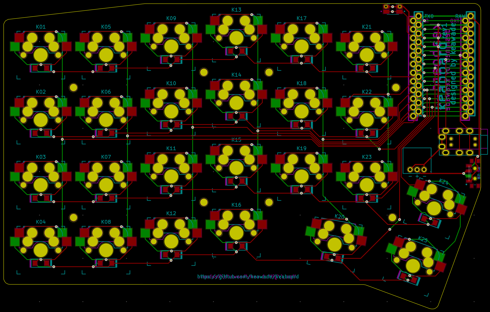

# keaboard

A split ergo 4x6 keyboard designed by Keith Wade.

Designed for use with the [nice!nano][nicenanoDocs] USB-C Bluetooth Pro Micro replacement
but should work with Pro Micros or Elite-Cs.

Inspired by the [ErgoTravel][ergotravel] keyboard designed by @jpconstantineau.

## Primary Features

- Split
- Ortho stagger
- Wireless option
- Hotswap MX switches
- Reversible PCB

## Revision 1

## Parts List

| Qty                   | Part                                                                                      |
| --------------------- | ----------------------------------------------------------------------------------------- |
| 2                     | Pro Micro footprint compatible microcontroller (Recommend Elite-C if not using nice!nano) |
| 2 sets of 12 pins     | Mill-Max low profile sockets                                                              |
| 24 (get extra though) | Mill-Max low profile pins                                                                 |
| 50                    | Kailh MX hotswap sockets                                                                  |
| 50                    | MX compatible switches                                                                    |
| 50                    | [1N4148W SMD diodes][diodes]                                                              |
| 2                     | PJ-320A TRRS female jack  (not required if wireless with nice!nano)                       |
| 2                     | [EVQ-9P701P tactile switch](resetSwitch)                                                  |

### Parts for Wireless Option

| Qty | Part                                     |
| --- | ---------------------------------------- |
| 2   | [nice!nano][nicenanoStore]               |
| 2   | [CUS-12TB][slideSwitch] for power switch |
| 2   | 3.7v rechargeable battery                |
| 2   | [3-pin socket][batterySocket]            |
| 2   | 2-pin plug                               |

## Potential Future Revisions

- Choc hotswap
- RGB underglow
- LED backlight
- RGB backlight

[nicenanoDocs]: https://docs.nicekeyboards.com/#/nice!nano/
[nicenanoStore]: https://splitkb.com/collections/keyboard-parts/products/nice-nano-rev1-0
[ergotravel]: https://github.com/jpconstantineau/ErgoTravel
[batterySocket]: ???
[diodes]: https://www.digikey.com/product-detail/en/1N4148W-G+RHG/1N4148W-GRHGCT-ND/7644279
[slideSwitch]: https://www.digikey.com/product-detail/en/nidec-copal-electronics/CUS-12TB/563-1102-1-ND/1124231
[resetSwitch]: https://www.digikey.com/product-detail/en/panasonic-electronic-components/EVQ-9P701P/P19095CT-ND/5872974
